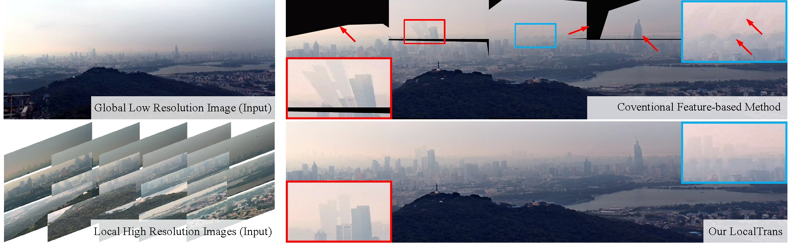

# [LocalTrans: A Multiscale Local Transformer Network for Cross-Resolution Homography Estimation](http://www.liuyebin.com/localtrans/localtrans.html)
Ruizhi Shao*, Gaochang Wu*, Yuemei Zhou, Ying Fu, Lu Fang, Yebin Liu

[](https://arxiv.org/abs/2106.04067)

This repository contains the official pytorch implementation of ”*LocalTrans: A Multiscale Local Transformer Network for Cross-Resolution Homography Estimation*“.

<!--  -->


## Citation
```
@inproceedings{shao2021localtrans,
title={LocalTrans: A Multiscale Local Transformer Network for Cross-Resolution Homography Estimation},
author={Shao, Ruizhi and Wu, Gaochang and Zhou, Yuemei and Fu, Ying and Fang, Lu and Liu, Yebin},
booktitle={IEEE Conference on Computer Vision (ICCV 2021)},
year={2021},
}
```
